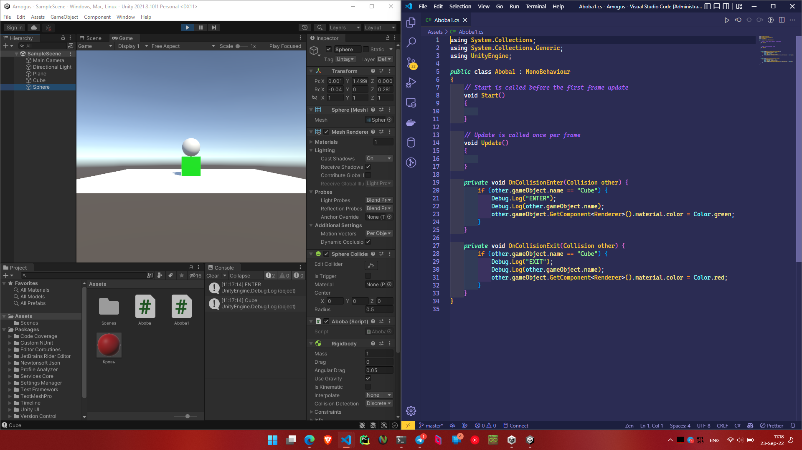
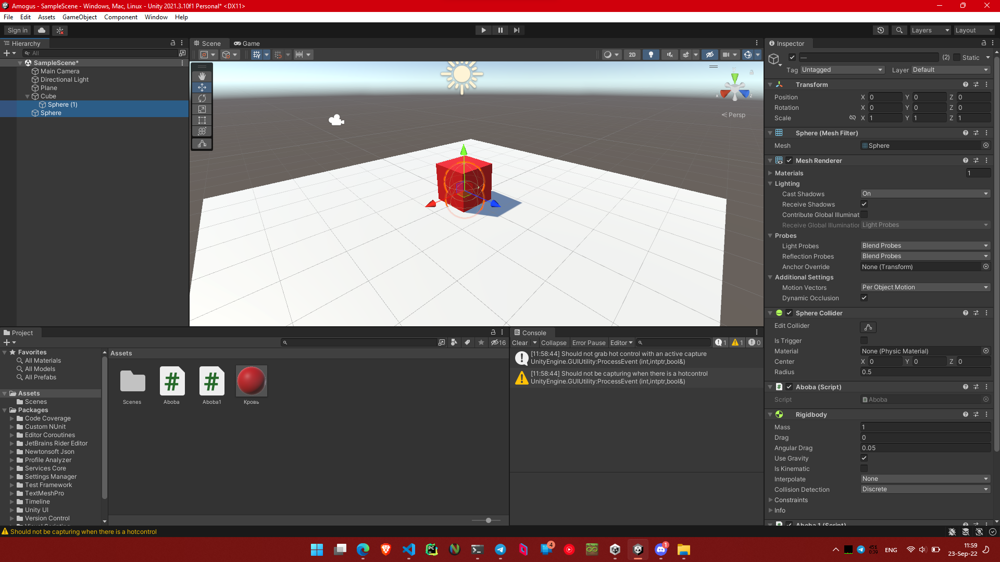
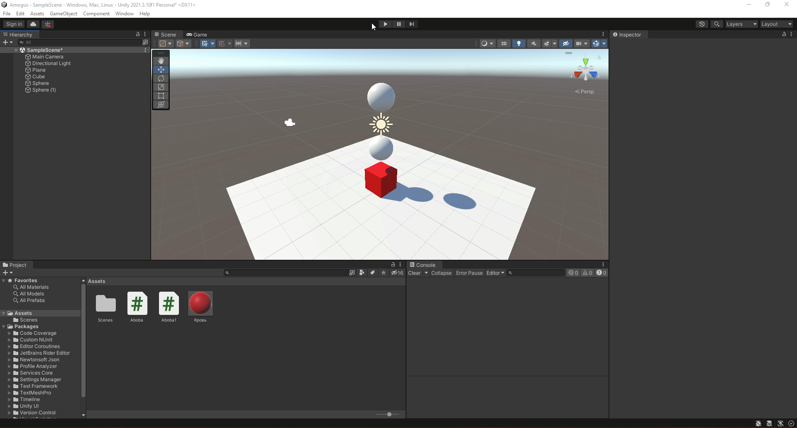
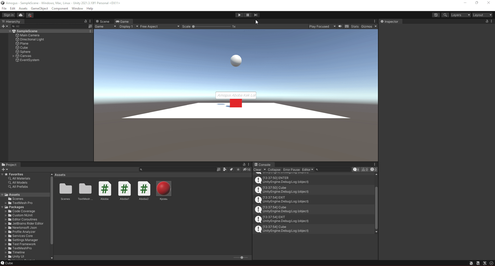

# АНАЛИЗ ДАННЫХ И ИСКУССТВЕННЫЙ ИНТЕЛЛЕКТ [in GameDev]
Отчет по лабораторной работе #1 выполнил(а):
- Решетников Владислав Павлович
- РИ000024
Отметка о выполнении заданий (заполняется студентом):

| Задание | Выполнение | Баллы |
| ------ | ------ | ------ |
| Задание 1 | * | 60 |
| Задание 2 | * | 20 |
| Задание 3 | * | 20 |

знак "*" - задание выполнено; знак "#" - задание не выполнено;

Работу проверили:
- к.т.н., доцент Денисов Д.В.
- к.э.н., доцент Панов М.А.
- ст. преп., Фадеев В.О.

Структура отчета

- Данные о работе: название работы, фио, группа, выполненные задания.
- Цель работы.
- Задание 1.
- Код реализации выполнения задания. Визуализация результатов выполнения (если применимо).
- Задание 2.
- Код реализации выполнения задания. Визуализация результатов выполнения (если применимо).
- Задание 3.
- Код реализации выполнения задания. Визуализация результатов выполнения (если применимо).
- Выводы.
- ✨Magic ✨

## Цель работы
Ознакомиться с основными функциями Unity и взаимодействием с объектами внутри редактора.

## Задание 1
### Пошагово выполнить каждый пункт раздела "ход работы" с описанием и примерами реализации задач по теме лабораторной работы.
Ход работы:
1. Создать новый проект из шаблона 3D-Core.
2. Проверить, что настроена интеграция редактора Unity и Visual Studio Code.
3. Создать объект `Plane`;
4. Создать объект `Cube`;
5. Создать объект `Sphere`;
6. Установить компонент `Sphere Collider` для объекта Sphere;
7. Настроить `Sphere Collider` в роли триггера;
8. Объект куб перекрасить в красный цвет;
9. Добавить кубу симуляцию физики, при этом куб не должен проваливаться под `Plane`;
10. Написать скрипт, который будет выводить в консоль сообщение о том, что объект Sphere столкнулся с объектом Cube;
11. При столкновении Cube должен менять свой цвет на зелёный, а при завершения столкновения обратно на красный.

Результат выполнения хода работы:

## Задание 2
### Продемонстрируйте на сцене в Unity следующее:

- Что произойдёт с координатами объекта, если он перестанет быть дочерним?

- Создайте три различных примера работы компонента RigitBody?

Ход работы:
1. Я помеестил один объект в другой объект и сравнил их параметры с параметрами предыдущего состояния. Параметры координат отличаются, и в системе у дочернего компонента они релятивны родительским.
Для демонстрации я установил им координаты на (0, 0, 0)

2. Я создал три различных примера работы компонента RigitBody, с Use Gravity, с Is Kinematic и без них.
Как видно на записи, при включенном Use Gravity объекты падают, при включенном Is Kinematic объекты не падают, но при этом они не реагируют на столкновения.©GitHub Copilot

## Задание 3
### Реализуйте на сцене генерацию n кубиков. Число n вводится пользователем после старта сцены.

1. Я создал `InputField` и импортнул все предлагаемые ассеты. Потом написал скрипт, который создает n кубиков в координате шара. Далее я добавил этот скрипт к `InputField`. Получилось!

## Выводы

Я выполнил задания

## Powered by

**BigDigital Team: Denisov | Fadeev | Panov**
