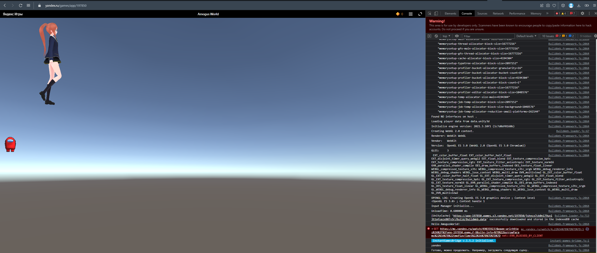

# Разработка игровых сервисов
Отчет по лабораторной работе #2 выполнил(а):
- Решетников Владислав Павлович
- РИ000024
Отметка о выполнении заданий (заполняется студентом):

| Задание | Выполнение | Баллы |
| ------ | ------ | ------ |
| Задание 1 | * | 60 |
| Задание 2 | * | 20 |
| Задание 3 | * | 20 |

знак "*" - задание выполнено; знак "#" - задание не выполнено;

Работу проверили:
- к.т.н., доцент Денисов Д.В.
- к.э.н., доцент Панов М.А.
- ст. преп., Фадеев В.О.

Структура отчета

- Данные о работе: название работы, фио, группа, выполненные задания.
- Цель работы.
- Задание 1.
- Код реализации выполнения задания. Визуализация результатов выполнения (если применимо).
- Задание 2.
- Код реализации выполнения задания. Визуализация результатов выполнения (если применимо).
- Задание 3.
- Код реализации выполнения задания. Визуализация результатов выполнения (если применимо).
- Выводы.
- ✨Magic ✨

## Цель работы
Создание интерактивного приложения и изучение принципов
интеграции в него игровых сервисов.

## Задание 1
### По теме видео практических работ 1-5 повторить реализацию игры на Unity. Привести описание выполненных действий.
Ход работы:
1. Я повторил каждый шаг, но сделал свою игру уникальной, добавив в нее новые объекты и сделав свою карту.
2. Залил приложение на яндекс.игры.

Результат выполнения хода работы:


## Задание 2
### В проект, выполненный в предыдущем задании, добавить систему проверки того, что SDK подключен (доступен в режиме онлайн и отвечает на запросы);

Ход работы:
1. Я скачал официальный SDK (универсальный InstantGamesBridge, который официально прописан в доках яндекс.игрушек и не прописан в доках социальной сети вко нтакте (которую удалили в понедельник)) и положил его в папку ассетов. Потом добавил условие и логгирование о статусе работы SDK.
```cs
using InstantGamesBridge;
using UnityEngine;

public class LoadingScene : MonoBehaviour
{
    private void Start()
    {
        Debug.Log("Hello AmogusWorld!");
        Bridge.Initialize(isInitialized =>
        {
            if (isInitialized)
            {
                Debug.Log(Bridge.platform.id);
                Debug.Log("Готово, можно продолжать. Например, загружать следующую сцену.");
            }
            else
            {
                Debug.Log("Ошибка. Что-то пошло не так.");
            }
        });
    }
}
```

Результат выполнения хода работы:

[Ссылка на мое игровое произведение, выложенное на яндекс.гейминг](https://yandex.ru/games/app/197850?draft=true&lang=ru)

## Задание 3
1. Произвести сравнительный анализ игровых сервисов Яндекс Игры и VK Game;
2. Дать сравнительную характеристику сервисов, описать функционал;
3. Описать их методы интеграции с Unity;
4. Произвести сравнение, сделать выводы;
5. Подготовить реферат по результатам выполнения пунктов 1-4 .

Ход работы:
1. Сравнительный анализ:
2. Сравнительная характеристика сервисов с их официальных страниц:
    - Яндекс Игры: https://games.yandex.ru/
        • более 50 миллионов пользователей в месяц
    - VK Game: https://vk.com/games
        • 10+ миллионов активных игроков ежемесячно.
        • 500+ операций API ВКонтакте для интеграции.
        • Бесплатные методы продвижения.
        • Рекомендации и лучшие практики от платформы.
3. Сервисы выше имеют разные методы интеграции с Unity. Яндекс Игры имеет ссылки на различные SDK на своем сайте, а VK Game не имеет, все придётся делать самому, или использовать платные, устаревшие или неофициальные решения.
Я использую универсальный метод интеграции, благодаря которому я пишу интеграцию сразу под все поддерживаемые фреймворком платформы.
4. Я сделал вывод, что Яндекс Игры лучше, чем VK Game, потому что у него больше аудитория, и есть SDK (они прописаны в доках, что косвенно означает лучшую поддержку от команды Яндекс).
5. Реферат: У Яндекс Игр больше пользователей, чем у VK Game. Также Яндекс Игры имеет свой собственный SDK, а VK Game не имеет, обычному разработчику все придётся делать самому (наличие ссылок на SDK косвенно означает, что поддержка разработчика у Яндекса лучше). В любом случае, мне абсолютно все равно, какую платформу выбирать, так как я делаю сразу под все одновременно.
## Выводы

Я выполнил задания

Written via GitHub Copilot with love <3

## Powered by

**BigDigital Team: Denisov | Fadeev | Panov**
