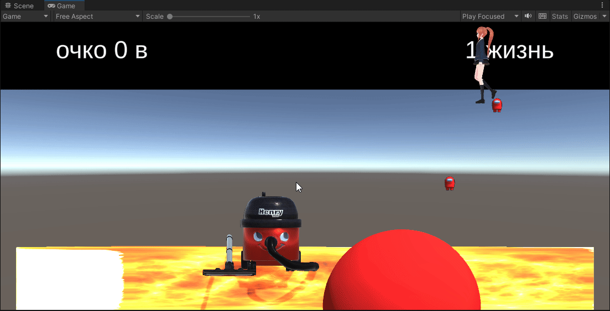

# Разработка игровых сервисов
Отчет по лабораторной работе #3 выполнил(а):
- Решетников Владислав Павлович
- РИ000024
Отметка о выполнении заданий (заполняется студентом):

| Задание | Выполнение | Баллы |
| ------ | ------ | ------ |
| Задание 1 | * | 60 |
| Задание 2 | * | 20 |
| Задание 3 | * | 20 |

знак "*" - задание выполнено; знак "#" - задание не выполнено;

Работу проверили:
- к.т.н., доцент Денисов Д.В.
- к.э.н., доцент Панов М.А.
- ст. преп., Фадеев В.О.

Структура отчета

- Данные о работе: название работы, фио, группа, выполненные задания.
- Цель работы.
- Задание 1.
- Код реализации выполнения задания. Визуализация результатов выполнения (если применимо).
- Задание 2.
- Код реализации выполнения задания. Визуализация результатов выполнения (если применимо).
- Задание 3.
- Код реализации выполнения задания. Визуализация результатов выполнения (если применимо).
- Выводы.
- ✨Magic ✨

## Цель работы
Интеграция интерфейса пользователя в разрабатываемое интерактивное приложение.

## Задание 1
### Используя видео-материалы практических работ 1-5 повторить реализацию игровых механик:
– 1 Практическая работа «Реализация механизма ловли объектов».
– 2 Практическая работа «Реализация графического интерфейса с добавлением счетчика очков».

Ход работы:
1. Я повторил реализацию игровых механик.

Результат выполнения хода работы:

## Задание 2
– 3 Практическая работа «Уменьшение жизни. Добавление текстур».
– 4 Практическая работа «Структурирование исходных файлов в папке».

Ход работы:
1. Я повторил реализацию игровых механик.

Результат выполнения хода работы:

## Задание 3
– 5 Практическая работа «Интеграция игровых сервисов в готовое
приложение».

Ход работы:
1. Не знаю зачем это задание продублировали ведь оно было во второй лабе ¯\\\_( ͡° ͜ʖ ͡°)_/¯. Советую глянуть его у меня в репозитории.

## Выводы

Я выполнил задания

## Powered by

**BigDigital Team: Denisov | Fadeev | Panov**
