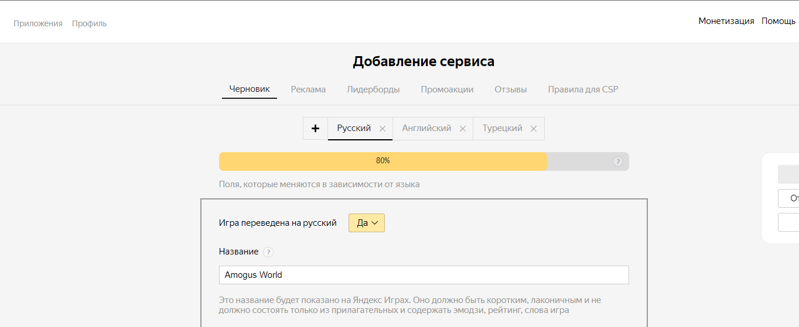
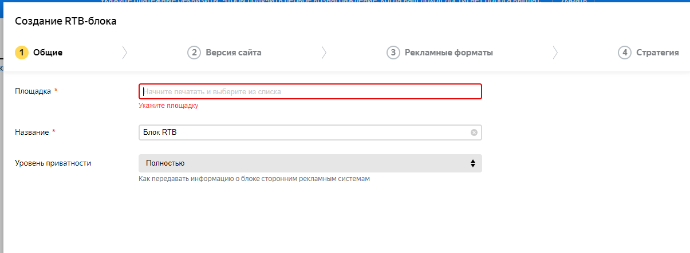

# Разработка игровых сервисов
Отчет по лабораторной работе #3 выполнил(а):
- Решетников Владислав Павлович
- РИ000024
Отметка о выполнении заданий (заполняется студентом):

| Задание | Выполнение | Баллы |
| ------ | ------ | ------ |
| Задание 1 | * | 60 |
| Задание 2 | * | 20 |
| Задание 3 | * | 20 |

знак "*" - задание выполнено; знак "#" - задание не выполнено;

Работу проверили:
- к.т.н., доцент Денисов Д.В.
- к.э.н., доцент Панов М.А.
- ст. преп., Фадеев В.О.

Структура отчета

- Данные о работе: название работы, фио, группа, выполненные задания.
- Цель работы.
- Задание 1.
- Код реализации выполнения задания. Визуализация результатов выполнения (если применимо).
- Задание 2.
- Код реализации выполнения задания. Визуализация результатов выполнения (если применимо).
- Задание 3.
- Код реализации выполнения задания. Визуализация результатов выполнения (если применимо).
- Выводы.
- ✨Magic ✨

## Цель работы
Интеграция интерфейса пользователя в разрабатываемое интерактивное приложение.

## Задание 1
### Используя видео-материалы практических работ 1-5 повторить реализацию приведенного ниже функционала:
– 1 Практическая работа «Интеграция баннерной рекламы»
– 2 Практическая работа «Интеграция видеорекламы»
– 3 Практическая работа «Показ видеорекламы пользователю за вознаграждение»
– 4 Практическая работа «Создание внутриигрового магазина»
– 5 Практическая работа «Система антиблокировки рекламы»

Ход работы:
1. Я повторил реализацию приведенного выше функционала, за исключением баннеров и покупок, так как яндекс не дает мне этот функционал. Показываются только тестовые Rawardable баннеры, которые смотрятся без получения за них денег.

Результат выполнения хода работы:

## Задание 2
### Добавить в приложение интерфейс для вывода статуса наличия игрока в сети (онлайн или офлайн).

Ход работы:
1. Я добавил в приложение интерфейс для вывода статуса наличия игрока в сети (онлайн или офлайн). Это видно в главном меню, где над волшебницей написан ник игрока, если он онлайн, и Tyanocka, если он офлайн или не авторизован (для сохранения данных в этом режиме используется Local Storage).

Результат выполнения хода работы показан в задании 1, пока сдк еще не успела ответить, так как я не блокирую игру на момент авторизации.

## Задание 3
– Предложить наиболее подходящий на ваш взгляд способ монетизации игры D.icker. Дать развернутый ответ с комментариями.

Ход работы:
1. Засунуть рекламу в игру, чтобы игроки не могли играть без рекламы. Поиграв в другие игры на ЯнГейминге я судорожно наклепал адблокер, который ее тотально аннигилирует (потому, что мой адблокер не справляется). В свою очередь можно пихнуть рекламу в обход DOM в canvas, и тогда ее не получится заблокировать, а если и использовать неизвестный доселе хостинг и отдавать с него рекламу (реализовать самому с помощью микросервиса на fastapi как пример), то будет вообще шикарные 100% прибыли с выживших от таких мер игроков (и скорее всего не на яндекс.игрищах, так как там вероятно запрещена неЯндексовская реклама).
2. Донат с прописанной экономикой, чтобы без него было сложно но можно (примерно такой же как в играх от supercell, но с меньшей ценой ввиду малоизвестности игры и компании, а также в угоду ЦА яндекс.игралищ и ру сегмента, не привыкшего много донатить в игры (в таком случае можно сделать игру более нацеленной на детей, но это должно давать существенные ограничения, с которыми придется мириться)).
3. А чтобы было ради чего играть и конечно же донатить и смотреть рекламу - в игру определенно необходимо добавить бонусов, смену локаций, противников, может быть даже новые механики или отдельные мини режимы. И все пропитано игровой валютой, которую можно покупать. При дальнейшем развитии можно мутить коллабы с другими играми или вселенными, чтобы обмениваться аудиторией и получать много шекелей на скинах. В общем - сначала нужно сделать нормальную игру, а потом уже думать о том, как ее конвертировать в бабло.

## Выводы

Я выполнил задания

## Powered by

**BigDigital Team: Denisov | Fadeev | Panov**
